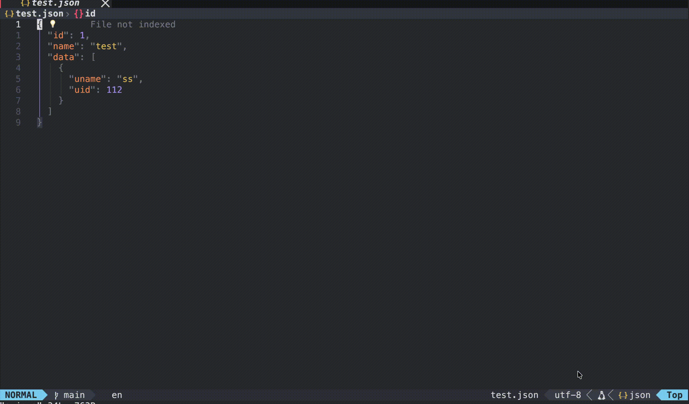
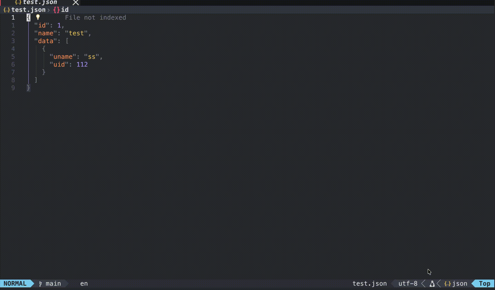

# coc-quicktype

Generate strongly typed models or serializers through JSON

通过json生成强类型模型或者序列化器

## Examples

### typescript

### java

### go

### rust

### cs

## Supported languages

1. python
2. typescript
3. java
4. go
5. swift
6. dart
7. cpp
8. javascript
9. php
10. rust
11. cs
12. elm

## Install

`:CocInstall coc-quicktype`

## Commands

`:CocCommand quicktype.generate`

## License

MIT

---

> This extension is built with [create-coc-extension](https://github.com/fannheyward/create-coc-extension)
